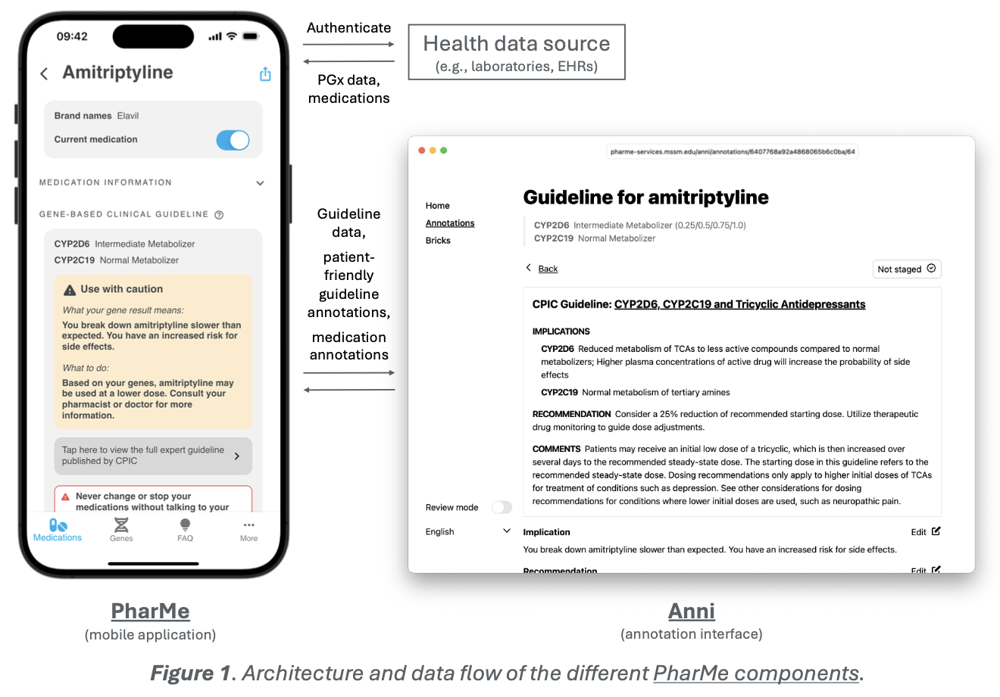
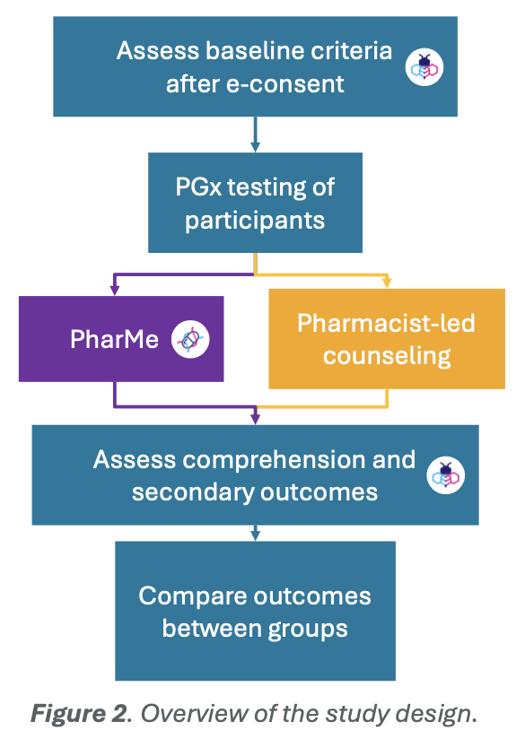
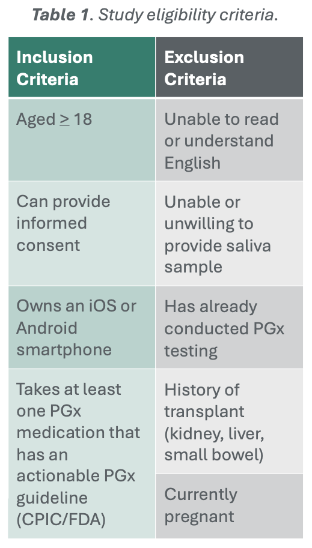
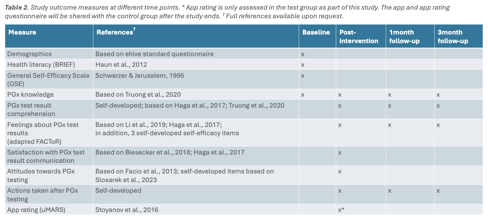

# PharMe Study

PharMe can receive pharmacogenomic data from various data sources and match
them locally on the phone in a privacy-conserving way with published CPIC and
FDA guidelines, which were annotated with patient-friendly texts in our
annotation interface, Anni (Figure 1).

We are conducting a randomized non-inferiority clinical trial comparing the
app's delivery of PGx results with standard-of-care pharmacist-led telehealth
counseling (Figure 2).

We recruited 200 patients from Mount Sinai (Table 1).

Primary outcome is comprehension of results at the time of delivery, secondary
outcomes are self-efficacy, satisfaction, feelings, and actions connected with
the result return (Table 2).

